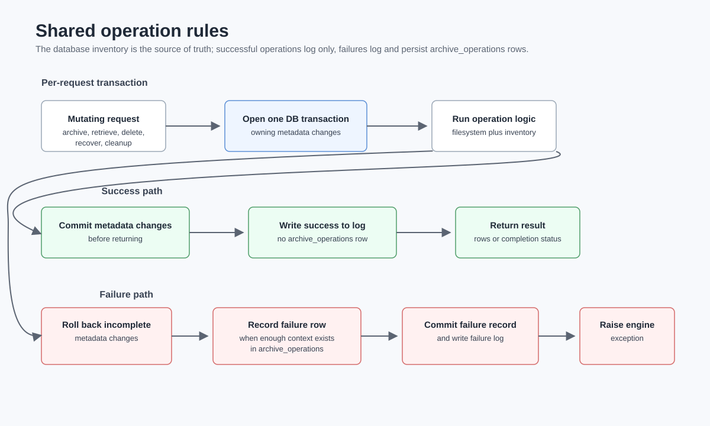
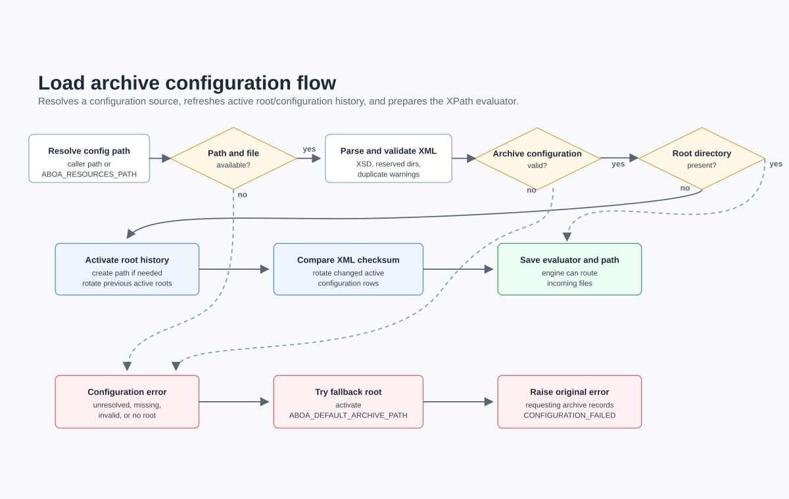
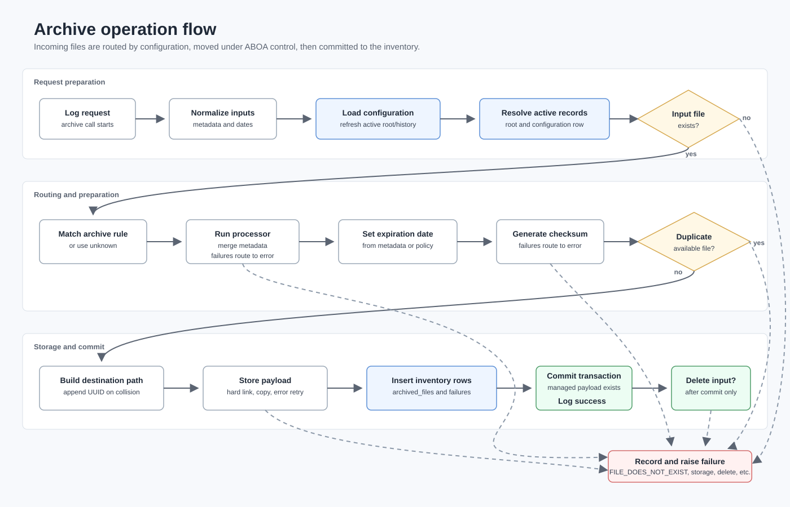
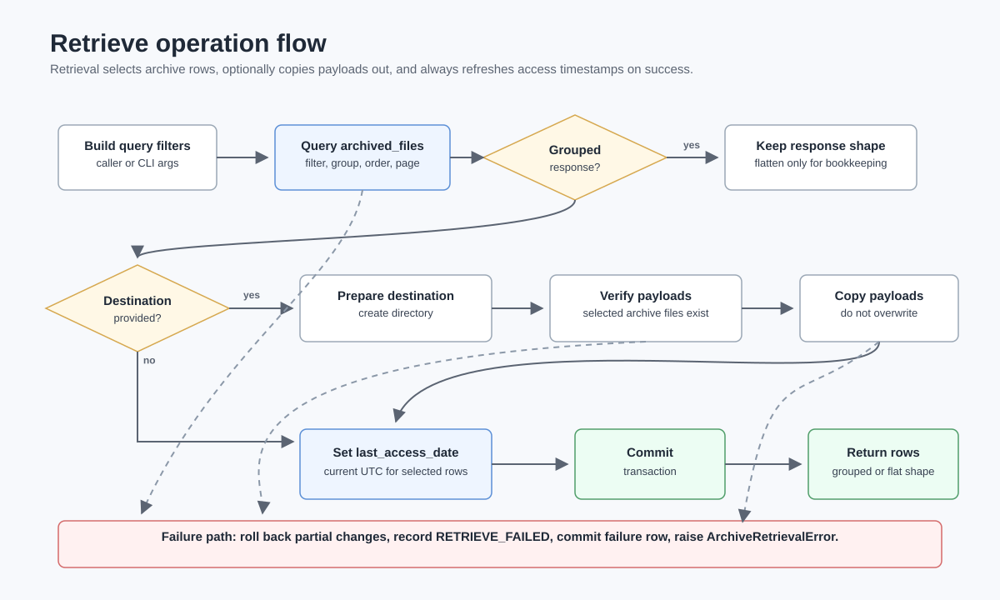
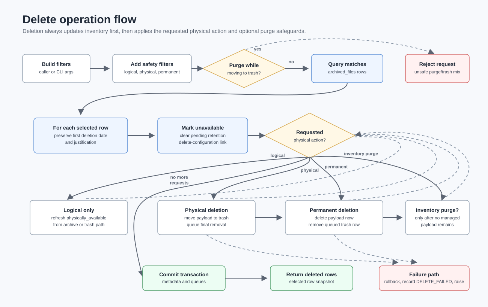
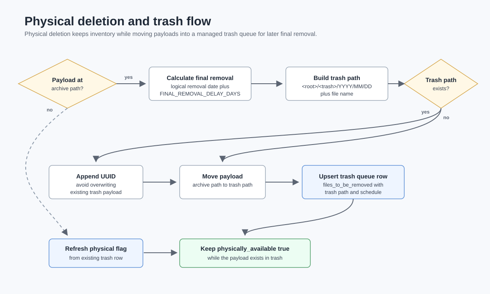
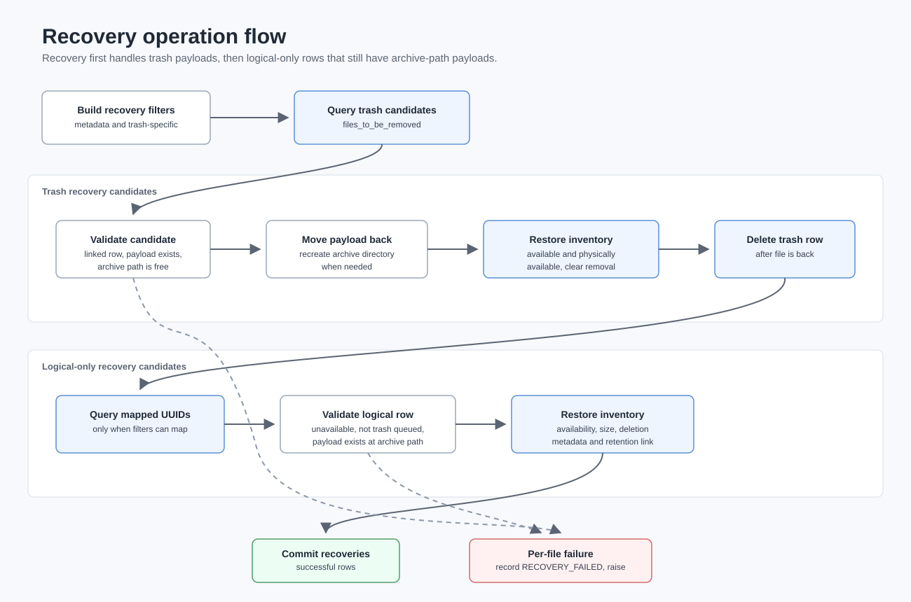
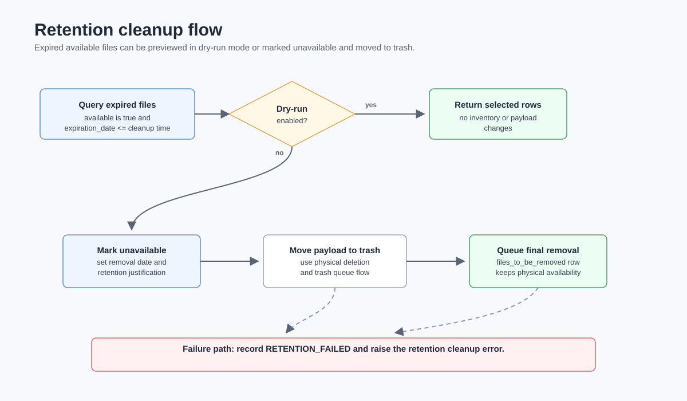
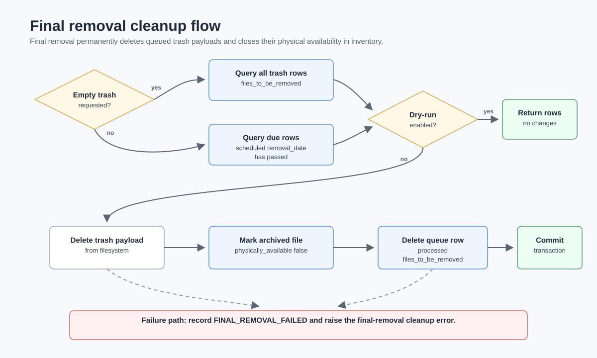
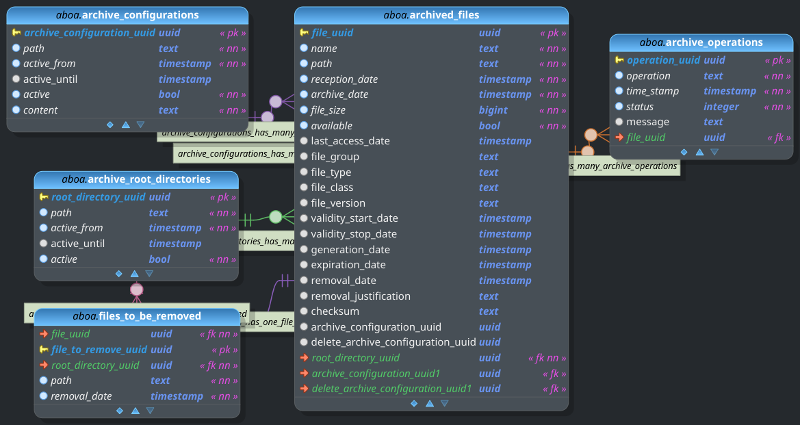

# ABOA

Archive for Business Operations Analysis.

ABOA stores files on a POSIX filesystem and keeps a PostgreSQL inventory of the
archived payloads, metadata, configuration history, root-directory history,
operation failures, trash queues, retention cleanup, and recovery state. The
current implementation exposes both command line tools and Python interfaces
through `aboa.engine.engine.Engine` and `aboa.engine.query.Query`.

## Contents

- [What ABOA Provides](#what-aboa-provides)
- [Quick Start With Docker](#quick-start-with-docker)
- [Local Python Setup](#local-python-setup)
- [Runtime Configuration](#runtime-configuration)
- [Archive Configuration XML](#archive-configuration-xml)
- [Command Line Tools](#command-line-tools)
- [Python API](#python-api)
- [Operation Flow Schematics](#operation-flow-schematics)
- [Data Model](#data-model)
- [Development Layout](#development-layout)
- [Tests](#tests)

## What ABOA Provides

- Archive files into a managed root directory using configurable routing rules.
- Keep inventory metadata in SQLAlchemy/PostgreSQL tables.
- Track active archive roots and active XML archive-configuration history.
- Detect duplicate archived file names and route archive failures into the
  internal `error` area when the input can still be brought under ABOA control.
- Retrieve inventory rows and optionally copy payloads to a destination folder.
- Logically delete files, move payloads to trash, permanently delete payloads, or
  purge inventory entries when no managed payload remains.
- Recover files from trash or from logical-only deletion.
- Apply retention cleanup and final trash removal cleanup.
- Record failed operations in `archive_operations` while successful operations
  are written only to the log.

## Quick Start With Docker

The development compose file starts an ABOA container and a PostgreSQL/PostGIS
database container. The source checkout is mounted into the ABOA container at
`/aboa`.

```bash
docker compose -f compose_dev.yml up -d --build
docker compose -f compose_dev.yml exec aboa initialize_aboa_ddbb.sh
docker compose -f compose_dev.yml exec aboa aboa_archive.py --file /aboa/src/tests/inputs/sample.txt
docker compose -f compose_dev.yml exec aboa aboa_retrieve.py --name sample.txt --list
```

`initialize_aboa_ddbb.sh` calls `aboa_init.py -y` and recreates the configured
database from `src/aboa/datamodel/aboa_data_model.sql`, so it deletes existing ABOA
inventory data for that database.

## Local Python Setup

For local development outside Docker, install the package from `src/setup.py`:

```bash
python3 -m venv .venv
source .venv/bin/activate
python -m pip install -e "src[tests]"
```

Set the runtime paths before importing or running ABOA:

```bash
export ABOA_RESOURCES_PATH="$PWD/src/aboa/config"
export ABOA_LOG_PATH="$PWD/log"
export ABOA_DEFAULT_ARCHIVE_PATH="/tmp/aboa_archive"
mkdir -p "$ABOA_LOG_PATH" "$ABOA_DEFAULT_ARCHIVE_PATH"
```

## Runtime Configuration

ABOA reads JSON and XML runtime resources from `ABOA_RESOURCES_PATH`. The XML
schema is bundled with the `aboa` package.

Required environment variables:

- `ABOA_RESOURCES_PATH`: directory containing `datamodel.json`,
  `engine.json`, and `archive_configurations.xml`.
- `ABOA_LOG_PATH`: directory where rotating log files are written.

Optional environment variables:

- `ABOA_DEFAULT_ARCHIVE_PATH`: fallback archive root used when the XML archive
  configuration cannot be activated.
- `ABOA_DDBB_HOST`: overrides the host from `datamodel.json`.
- `ABOA_LOG_LEVEL`: overrides the log level from `engine.json`.
- `ABOA_STREAM_LOG`: enables stream logging in addition to the rotating file log.
- `ABOA_LOG_MAX_BYTES` and `ABOA_LOG_MAX_BACKUP`: override log rotation limits.

`src/aboa/config/engine.json` configures logging and archive cleanup behavior:

```json
{
  "LOG": {
    "LEVEL": "INFO",
    "MAX_BYTES": 50000000,
    "MAX_BACKUP": 30
  },
  "ARCHIVE": {
    "FINAL_REMOVAL_DELAY_DAYS": 30
  }
}
```

Archived payloads are stored below the active root using:

```text
<root_directory>/<target_directory>/<YEAR>/<MONTH>/<DAY>/<file_name>
```

The reserved target directories are `unknown`, `error`, and `trash`.

## Archive Configuration XML

The default configuration lives at `src/aboa/config/archive_configurations.xml`.
ABOA validates this file with `src/aboa/schemas/aboa_archive_configurations.xsd`.

```xml
<archive_configurations root_directory="/tmp/aboa_archive">
  <archive_configuration file_group="invoices">
    <file_mask>*.pdf</file_mask>
    <file_directory>invoices</file_directory>
    <retention_policy active="true" key="archive_date">P180D</retention_policy>
  </archive_configuration>
  <retention_policies>
    <retention_policy active="true" key="validity_stop_date">P365D</retention_policy>
  </retention_policies>
</archive_configurations>
```

Archive rules are evaluated by file mask. A matching rule sets the target
directory, file group, optional processor module, and optional retention policy.
If no rule matches, ABOA stores the file in the internal `unknown` area with file
group `unknown`.

Processors are importable Python modules that expose `process(file_path)` and
return a metadata dictionary. Supported metadata includes file type, class,
version, validity dates, generation date, and expiration date.

Retention policies use XML duration values such as `P30D` and can use
`generation_date`, `reception_date`, `archive_date`, or `validity_stop_date` as
the base key.

## Command Line Tools

The package installs these console commands:

```bash
aboa_init.py [-f /path/to/aboa_data_model.sql] [-y]
aboa_archive.py --file /path/to/file [--delete] [--expiration-date DATETIME]
aboa_retrieve.py [filters] [--list] [--destination-path /path/to/output]
aboa_delete.py [filters] [--physical | --permanent] [--purge-entry] [--reason TEXT]
aboa_recover.py [archived-file filters | trash filters] [--list]
aboa_clean_up.py [--dry-run]
aboa_clean_up.py --final-removal [--dry-run]
aboa_clean_up.py --empty-trash [--dry-run]
```

Common examples:

```bash
aboa_archive.py --file /data/incoming/report.txt --delete
aboa_archive.py --file /data/incoming/invoice.pdf --expiration-date 2026-12-31T00:00:00
aboa_retrieve.py --name "%.txt" --order-by archive_date --descending --list
aboa_retrieve.py --uuid <file_uuid> --destination-path /tmp/retrieved
aboa_delete.py --uuid <file_uuid> --reason manual_delete
aboa_delete.py --uuid <file_uuid> --physical
aboa_delete.py --uuid <file_uuid> --permanent --purge-entry
aboa_recover.py --uuid <file_uuid>
aboa_recover.py --trash-uuid <file_to_remove_uuid>
aboa_clean_up.py --dry-run
aboa_clean_up.py --final-removal
```

Retrieve, delete, and recover commands share many inventory filters, including:

- Text filters: `--uuid`, `--name`, `--path`, `--root-directory-uuid`,
  `--file-group`, `--file-type`, `--file-class`, `--file-version`,
  `--archive-configuration-uuid`, `--delete-archive-configuration-uuid`,
  `--removal-justification`, and `--checksum`.
- Date filters: `--reception-date`, `--archive-date`, `--last-access-date`,
  `--validity-start-date`, `--validity-stop-date`, `--generation-date`,
  `--expiration-date`, and `--removal-date`.
- Numeric and boolean filters: `--file-size`, `--available`, and
  `--physically-available`.
- Trash recovery filters: `--trash-uuid`, `--trash-path`,
  `--trash-root-directory-uuid`, and `--trash-removal-date`.

Filter values may use operators such as `==`, `!=`, `<`, `<=`, `>`, and `>=`
for arithmetic/date filters. Text filters also expose `--<filter>-op` options
for text operators. Run any command with `--help` for the exact supported options.

## Python API

Use `Engine` for mutating operations and `Query` for read-only inventory access.

```python
from aboa.engine.engine import Engine
from aboa.engine.query import Query

engine = Engine()
try:
    engine.archive_file("/data/incoming/report.txt", delete=True)
    rows = engine.retrieve_files(
        filters={"names": {"filter": "%.txt", "op": "like"}},
        order_by={"field": "archive_date", "descending": True},
    )
finally:
    engine.close_session()

query = Query()
try:
    active_root = query.get_active_root_directory()
    failures = query.get_archive_operations(
        operations={"filter": "archive", "op": "like"}
    )
finally:
    query.close_session()
```

Important write-side methods include `archive_file`, `retrieve_files`,
`delete_files`, `delete_archived_file_entries`, `recover_files_from_trash`,
`move_archived_file_to_trash`, and `delete_archived_file_permanently`.

## Operation Flow Schematics

### Shared Operation Rules



### Load Archive Configuration



### Archive Operation



### Retrieve Operation



### Delete Operation



### Physical Deletion And Trash



### Recovery Operation



### Retention Cleanup



### Final Removal Cleanup



## Data Model

The DDBB model, stored in `src/aboa/datamodel/aboa_data_model.dbm`, is built using pgModeler. The tool is then used to generate the SQL instructions, stored in `src/aboa/datamodel/aboa_data_model.sql`, to initialize the DDBB.



Main inventory tables:

- `archive_root_directories`: active and historical archive roots.
- `archive_configurations`: active and historical XML configuration snapshots.
- `archived_files`: metadata for archived payloads and logical/physical
  availability.
- `archive_operations`: failed operation records.
- `files_to_be_removed`: trash payloads queued for final removal.

## Development Layout

- `src/aboa/datamodel`: SQLAlchemy model, database configuration, exported SQL,
  and pgModeler model.
- `src/aboa/engine`: archive, query, configuration, retention, and CLI logic.
- `src/aboa/processors`: metadata processor contract.
- `src/aboa/config`: default runtime configuration.
- `src/aboa/schemas`: bundled XML schemas.
- `src/aboa/scripts`: console script entry points and database initialization helpers.
- `src/tests`: pytest-based test suite.
- `development_plans`: design notes, requirements, and operation flow details.
- `doc/fig`: data model and operation-flow diagrams.

## Tests

Install the test extra and run the suite from the repository root:

```bash
python -m pip install -e "src[tests]"
export ABOA_RESOURCES_PATH="$PWD/src/aboa/config"
export ABOA_LOG_PATH="$PWD/log"
export ABOA_DEFAULT_ARCHIVE_PATH="/tmp/aboa_archive"
mkdir -p "$ABOA_LOG_PATH" "$ABOA_DEFAULT_ARCHIVE_PATH"
python -m pytest src/tests
```
